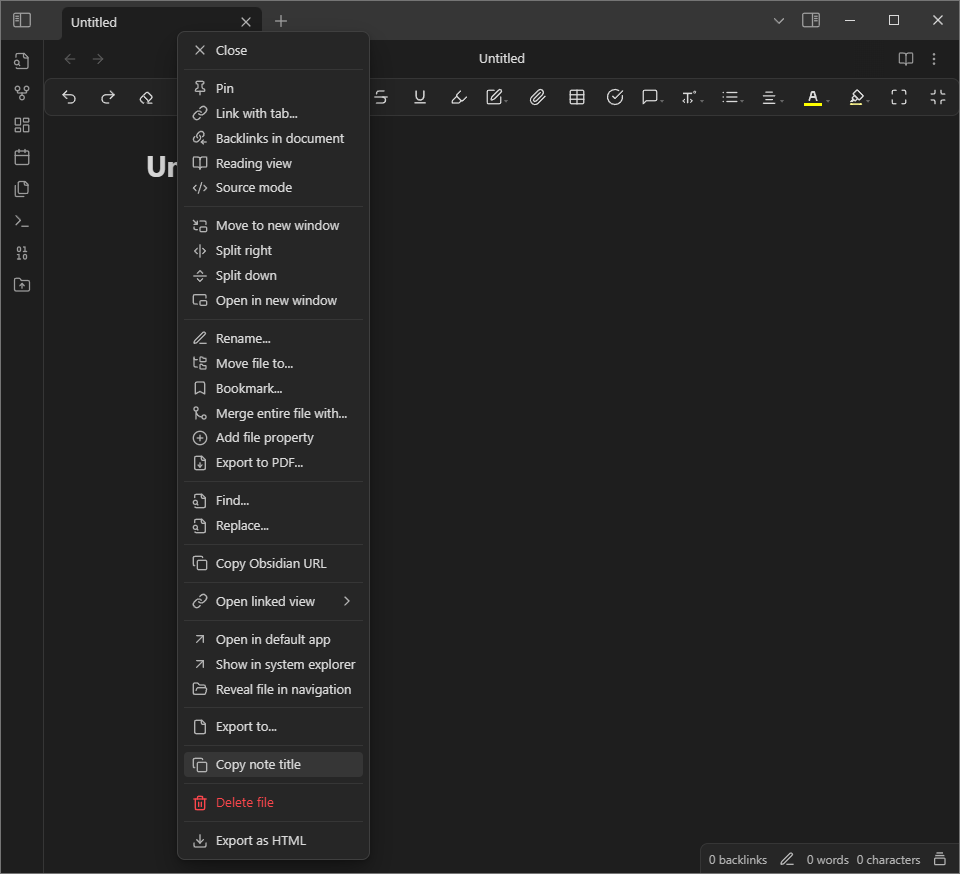
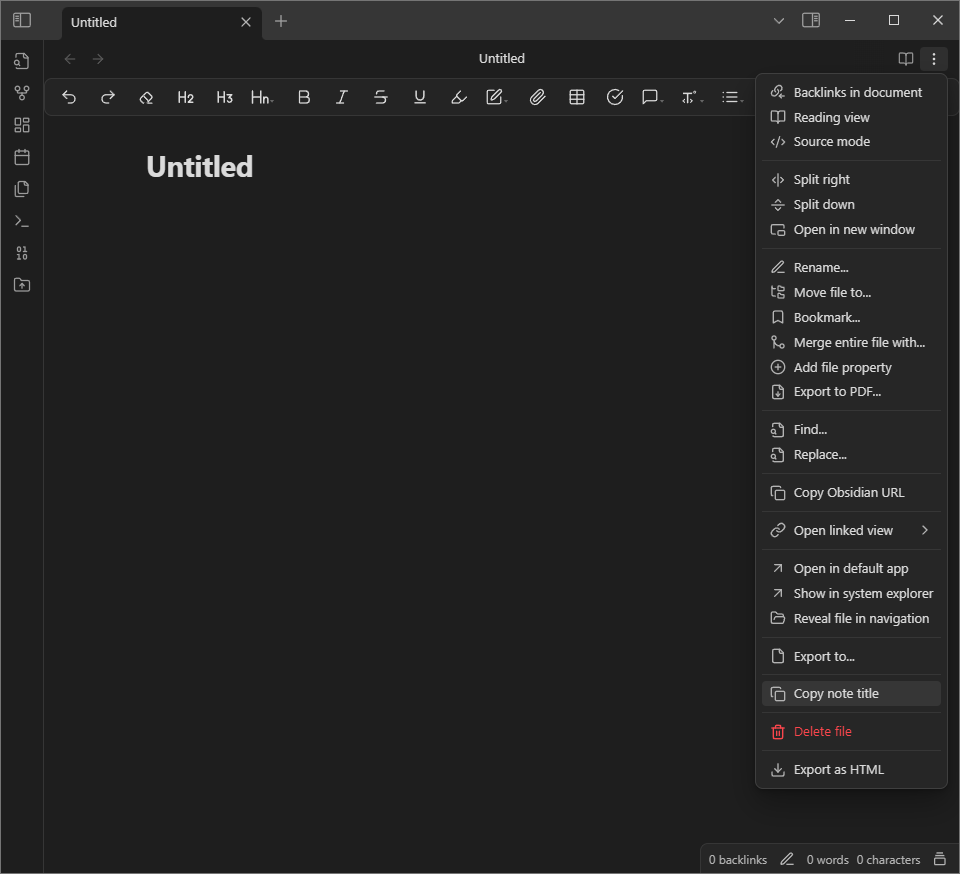
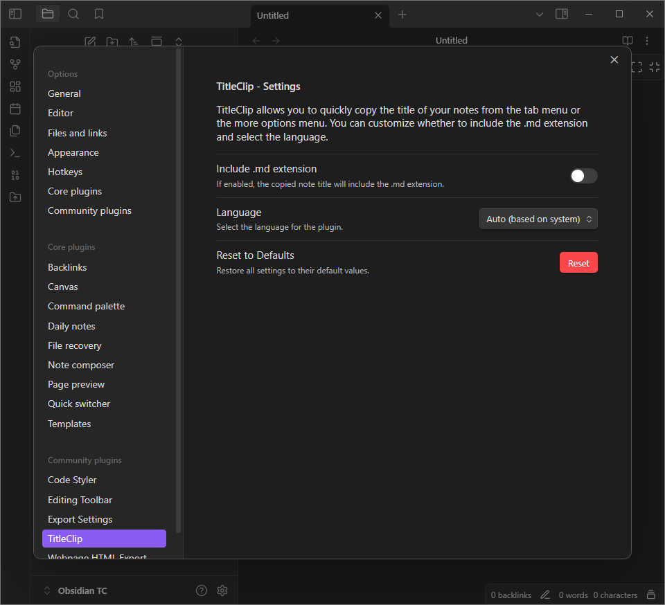

## **TitleClip - Copy Note Titles in Obsidian**

**TitleClip** is a lightweight and efficient Obsidian plugin that allows users to quickly copy note titles from the **Tab Menu** and the **More Options Menu**. It provides a simple way to reference note titles without manual editing.

---

### **🛠 Features (Version 1.0.2)**

✔ Copy note titles directly from the **Tab Menu** and the **More Options Menu**.  
✔ Option to **include or exclude** the `.md` extension when copying.  
✔ **Multilingual support**: English and Spanish, with auto-detection or manual selection.

---

### **📷 Screenshots**

#### **Copy from the Tab Menu**


#### **Copy from the More Options Menu**


#### **Settings Panel**



---

### **📦 Installation**

#### **From GitHub (Manual Installation)**

1. Download the latest **release** from [GitHub Releases](https://github.com/JavirtanLabs/TitleClip/releases).
2. Extract the files into your Obsidian vault under:
       
```
.obsidian/plugins/titleclip/
```
    
3. Enable **TitleClip** from **Obsidian → Settings → Community Plugins**.

#### **From Obsidian Community Plugins (Upcoming)**

- We are planning to submit the plugin to the Obsidian Community Plugin list.

---

### **⚙️ Usage**

1. Right-click on a **note tab** or open the **More Options Menu** (three dots inside a note).
2. Click **"Copy note title"**.
3. The title (without `.md`, unless enabled) will be copied to your clipboard.
4. Paste it anywhere you need! 🚀

---

### **🔍 Future Considerations**

We are currently evaluating new features for an upcoming version, including:

1️⃣ **Copying the full** note path within the vault.  
2️⃣ **Copying multiple selected note titles** at once.

If you have suggestions that improve usability while keeping the plugin lightweight, feel free to open an issue on GitHub!

---

### **📜 License**

**TitleClip** is released under the **GNU General Public License v3.0 (GPL-3.0)**.

This means:  
✔ You are free to use, modify, and distribute this software.  
✔ Any modifications or derivative works **must** also be licensed under GPL-3.0.  
✔ You **cannot** turn this software or its derivatives into proprietary software.

📄[Full license text](LICENSE) file in this repository.

---

### **🤝 Contributing to the Project**

We welcome contributions to improve the plugin! Here’s how you can help:  
✔ Report issues or suggest improvements in the GitHub [Issues](https://github.com/JavirtanLabs/TitleClip/issues) section.  
✔ Provide feedback on usability and performance.

All contributions should maintain the lightweight, user-friendly nature of the plugin.

---

### **☕ Support My Work**

**TitleClip is and will always remain a completely free plugin. However, if you find it useful and would like to support my work, please consider donating on Ko-fi. Any contribution is greatly appreciated—thank you!**  

**TitleClip es y seguirá siendo siempre un plugin totalmente gratuito. Sin embargo, si te ha resultado útil y quieres apoyar mi trabajo, por favor considera apoyarme en Ko-fi. Cualquier donación será bien recibida ¡Gracias!**  

[](https://ko-fi.com/jvfldd)  

---

**Ready to simplify your workflow? Get started with TitleClip today!** 🚀