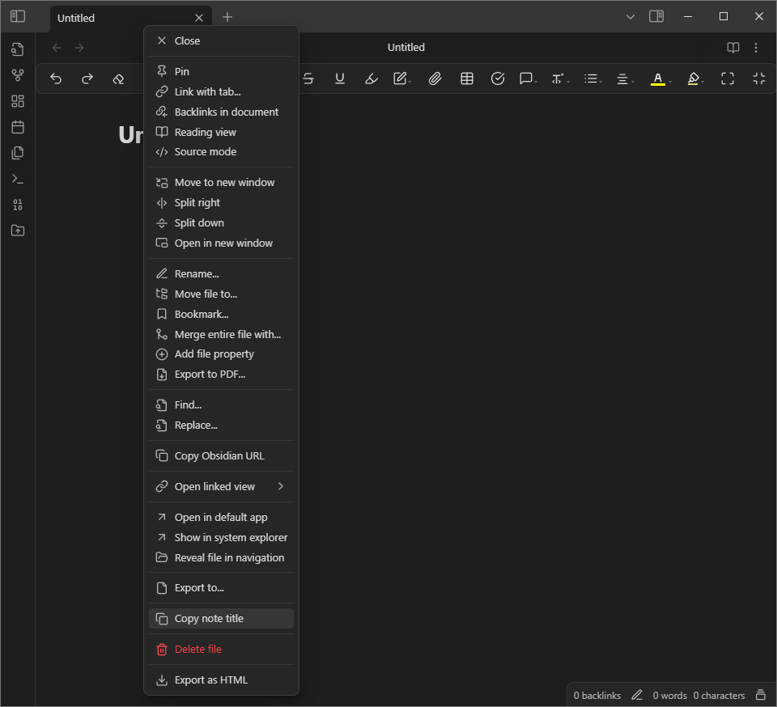
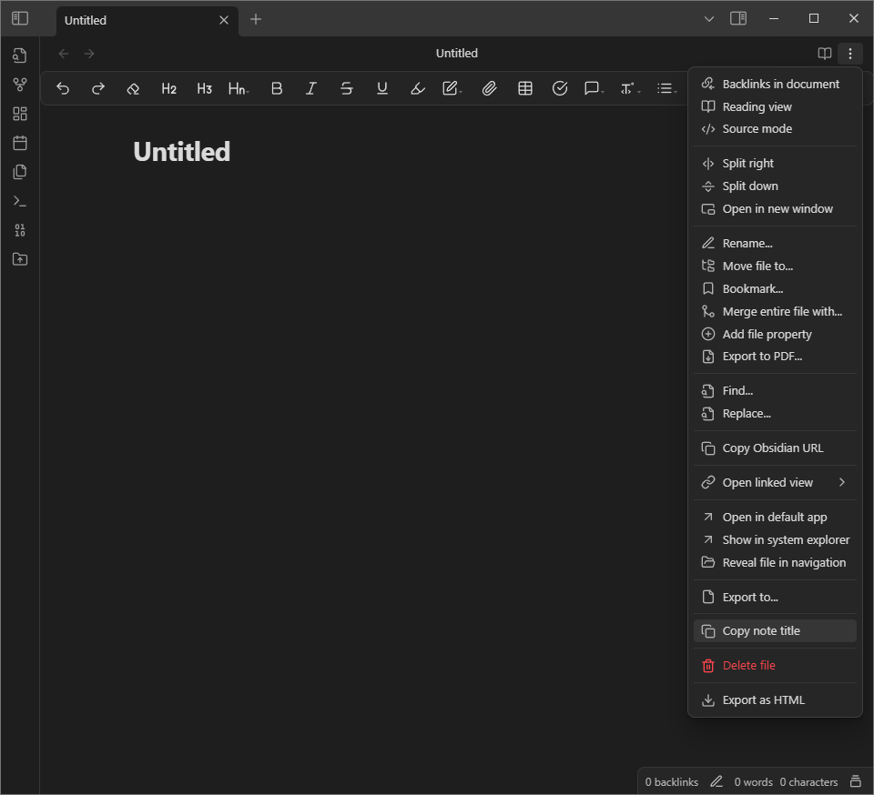
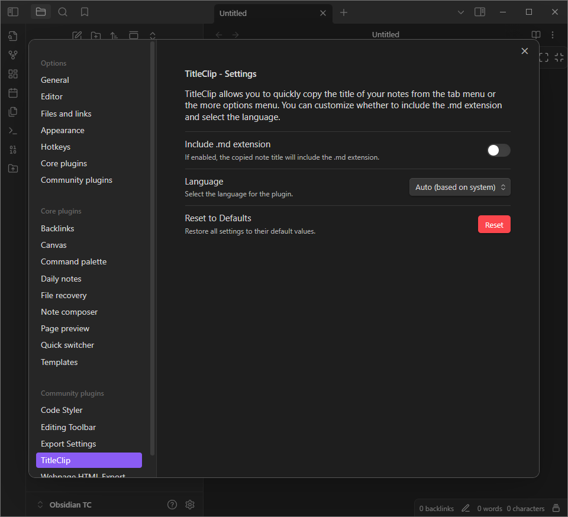

## **TitleClip - Copy Note Titles in Obsidian**

**TitleClip** is a lightweight and efficient Obsidian plugin that allows users to quickly copy note titles from the **Tab Menu** and the **More Options Menu**. It provides a simple way to reference note titles without manual editing.

---

### **🛠 Features**

✔ Copy note titles directly from the **Tab Menu** and the **More Options Menu**.  
✔ Option to **include or exclude** the `.md` extension when copying.  
✔ **Multilingual support**: English and Spanish, with auto-detection.  
✔ Manual language selection in the plugin settings.  
✔ **Optimized performance**: Loads translations only once for efficiency.

---

### **📷 Screenshots**

#### **Copy from the Tab Menu**


#### **Copy from the More Options Menu**


#### **Settings Panel**



---

### **📦 Installation**

#### **From GitHub (Manual Installation)**

1. Download the latest **release** from [GitHub Releases](https://github.com/JavirtanLabs/TitleClip/releases).
2. Extract the files into your Obsidian vault under:
       
```
.obsidian/plugins/titleclip/
```
    
3. Enable **TitleClip** from **Obsidian → Settings → Community Plugins**.

#### **From Obsidian Community Plugins (Upcoming)**

- We are planning to submit the plugin to the Obsidian Community Plugin list.

---

### **⚙️ Usage**

1. Right-click on a **note tab** or open the **More Options Menu** (three dots inside a note).
2. Click **"Copy note title"**.
3. The title (without `.md`, unless enabled) will be copied to your clipboard.
4. Paste it anywhere you need! 🚀

---

### **🌎 Contributing: Multilingual Support**

TitleClip supports **English and Spanish**, with automatic detection based on the system language.

Would you like to contribute with translations?

1. Check the `src/data/translations.json` file to see the current structure.
2. Add your language following the same format.
3. Submit a pull request on GitHub!

We appreciate all contributions that help make TitleClip more accessible worldwide.

---

### **🔍 Future Considerations**

At this stage, TitleClip is fully functional and optimized for its core purpose.  
However, we are open to suggestions from the community regarding potential improvements, provided they align with the lightweight nature of the plugin.

If you have an idea that enhances usability without overcomplicating the workflow, feel free to open an issue on GitHub!

---

### **📜 License**

**TitleClip** is released under the **GNU General Public License v3.0 (GPL-3.0)**.

This means:  
✔ You are free to use, modify, and distribute this software.  
✔ Any modifications or derivative works **must** also be licensed under GPL-3.0.  
✔ You **cannot** turn this software or its derivatives into proprietary software.

📄 Full license text(LICENSE) file in this repository.

---

### **🤝 Contributing to the Project**

We welcome contributions to improve the plugin! Here’s how you can help:  
✔ Report issues or suggest improvements in the GitHub [Issues](https://github.com/JavirtanLabs/TitleClip/issues) section.
✔ Help refine and expand translations.
✔ Provide feedback on usability and performance.

All contributions should maintain the lightweight, user-friendly nature of the plugin.

---

**Ready to simplify your workflow? Get started with TitleClip today!** 🚀